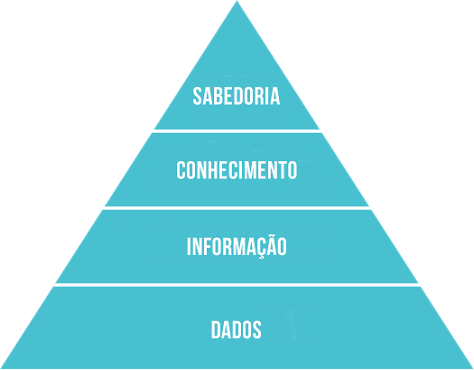

background-image: url(imagens/bi.jpg)
background-position: 50% 80%
```{r setup, include=FALSE}
options(htmltools.dir.version = FALSE)
xaringanExtra::use_logo(
  image_url = "Imagens/logo_ppg.png",
  link_url = "https://portal.ufgd.edu.br/pos-graduacao/mestrado-agronegocios/index"
)
```
# Sistemas de Inteligência Competitiva
### **Processo que envolve a coleta, análise e validação de informações sobre concorrentes, clientes, fornecedores,  e alianças estratégicas. Essas informações também podem incluir eventos econômicos, reguladores e políticos que tenham impacto potencial sobre os negócios da empresa.**

.right[
**Tyson (1997)**
]

---
# Sistemas de Inteligência Competitiva
## Hierarquia do Conhecimento

.pull-left[


(Ackoff, 1988)  
]
  
.pull-right[ 
### Informação, Conhecimento, Compreensão e Inteligência
- **Informações envelhecem rápido**
- **Conhecimento requer diagnóstico<br> e previsão**
- **Inteligência é permanente**
<br>
<br>
> **Empresas inteligentes precisam de proficionais do conhecimento.** <br> 
> (Dortier, 2005)

]
---
background-image: url(imagens/competitive-intelligence.jpg)
background-position: 90% 35%

# Sistemas de Inteligência Competitiva
.pull-left[
## Possibilidades:
- **Identificar pontos fortes e fracos, <br>ameaças e oportinidades de colaboração.**
- **Prever as ações dos concorrentes.**
- **Aperfeiçoar e diferenciar estratégias, posicionanmentos, operações e <br>desempenho financeiro.**
- **Competir por insumos e recursos.**
- **Evitar erros.**
- **Conquistar e manter fatias de mercado.**
> (Cosella, 2008)

]
---
background-image: url(imagens/comp.png)  
background-position: 50% 80%

# Análise dos Custos dos Concorrentes

.right-column[
## Objetivos

> **construir uma base de dados sobre os concorrentes <br>significativos a ser constantemente
atualizada a fim de <br>identificar potenciais  vantagens competitivas sustentáveis.**

> (Ward *et al.* 1992)

]
---
# Análise dos Custos dos Concorrentes
## Dados públicos:
.pull-left[
<br>
> Press (1990); Porter (1985); Abell e Hammond in Mintzberg e Quinn
(1996); Shank e Govindarajan (1997); Catelli (1999); Chiavenato (1999, 2006); Eitman et al.
(2000); Maximiano (2000); Kotler (2000); Young e O’byrne (2001); Besanko et al. (2004);
Pindyck e Rubinfeld (2005); Garvin (1987) apud Bowersox et al. (2006); Mansfield e Yore
(2006); Paranhos Filho (2007); Souza e Rocha (2009).

]
.pull-right[
Fonte | Sigla
------|------
Balanço Patrimonial | BP
Demonstração do Resultado do Exercício | DRE
Notas Explicativas | NE
Demonstração dos Fluxos de Caixa | DFC
Demonstração do Valor Adicionado | DVA
Relatório da Administração | RA
Formulário de Referência | FR
Balanço Social | BS
Sites Institucionais | SI
Bases de Dados | BD
Mídia | MI
]
---
# Análise dos Custos dos Concorrentes
## Modelo de gestão:
<br>

Item | Fonde de dados
-----|---------------
Existência de planejamento estratégico e operacional | RA, FR, BS, SI, MI, BD
Nível de detalhe dos controles | BP, DRE, NE, RA, FR, BS  
Grau de rigor no cumprimento de orçamento | FR
Grau de autonomia dos gestores | FR, BS
Critérios de avaliação de desempenho utilizados | FR, BS, SI
Cultura da empresa | DFC, DVA, RA, BS, SI, MI, BD
Estilos de liderança ou filosofia gerencial dos principais gestores | BP, DRE, NE, DFC, DVA, BS

---
# Análise dos Custos dos Concorrentes
.pull-left[
## Escala:
<br>

Item | Fonde de dados
-----|---------------
Indícios sobre o tamanho da empresa | BP, DRE, NE, DFC, DVA, FR, BS, SI, MI
Investimentos em capacidade de produção | BP, DRE, NE, RA, FR, BS, SI
Participação de mercado | RA, BS, SI, BD
]

.pull-right[
## Utilização da capacidade:
<br>

Item | Fonde de dados
-----|---------------
Volume efetivo de produção | BP, DRE, NE
Nível de ociosidade | FR
Estrutura de custos | NA

]
---
# Análise dos Custos dos Concorrentes
## Escopo:
<br>

Item | Fonde de dados
-----|---------------
Instalações e matérias-primas utilizadas para mais de um produto | RA, FR, SI, MI
Subprodutos gerados durante o processo de produção | BP, DRE, NE, FR
Linha de produtos da empresa | BP, DRE, NE, RA, FR, BS, SI, MI
Benefícios obtidos na aquisição de matérias primas | FR
Decisões de terceirização relacionadas ao processo de produção | FR, BD

---
# Análise dos Custos dos Concorrentes
## Experiência:
<br>

Item | Fonde de dados
-----|---------------
Investimentos realizados em treinamento | BP, DRE, NE, RA, BS, SI
Rotatividade da mão de obra | FR, BS
Efeitos causados pela experiência dos funcionários ou em determinado processo | FR, SI
Existência de programas de melhoria contínua | BP, DRE, NE
Tempo de atuação da empresa no mercado ou em determinado produto | RA, FR, SI
Causas de melhorias no processo de produção | BP, DRE, NE, RA, BS, SI

.right[

(Costa e Rocha, 2012)

]
---
# Estudo Aplicado
## Biosev S.A., Cosan S.A. e São Martinho S.A. (2007-2014)
<br>
Análise de regressão

.right[(Baiochi et al, 2015)]
---
# Referências
.pull-left[
BESANKO, D. et al. A economia da estratégia. 3. ed. São Paulo: Bookman, 2004.<br>
CASELLA, B. M. B. X. **Análise de custos de concorrentes:** estudo exploratório no setor de celulose e papel. 2008. Dissertação (Mestrado em Controladoria e Contabilidade: Contabilidade) - Faculdade de Economia, Administração e Contabilidade, Universidade de São Paulo, São Paulo, 2008. doi:10.11606/D.12.2008.tde-23102008-124826. Acesso em: 2021-11-04.<br>
CATELLI, A. **Controladoria:** uma abordagem da gestão econômica. São Paulo: Atlas, 1999.<br>
COSTA, S. A. da; ROCHA, Welington. Determinantes de custos de concorrentes: identificação a partir de
informações públicas. **Anais...** XIX Congresso Brasileiro de Custos – Bento Gonçalves, RS, Brasil, 12 a 14 de novembro de 2012.<br>

]
.pull-right[
CHIAVENATO, I. **Introdução à teoria geral da administração.** Rio de Janeiro: Campus, 1999.<br>
______. Administração Geral e Pública. Rio de Janeiro: Elsevier, 2006.<br>
DORTIER, J. F. *Les professionnels de l’intelligence: portrait de groupe*, **Les travailleurs du savoir, Sciences Humaines**. 2005, n° 157, pp. 28 - 33.<br>
EITMAN, D. et al. **Administração financeira internacional**. 9. ed. Porto Alegre: Bookman, 2002.<br>
GARVIN, D. Competing on the eight dimensions of quality. Harvard Business Review. Nov./Dec. 1987 *apud* BOWERSOX, Donald J.; CLOSS, David J.; COOPER, M. Bixby. **Gestão Logística de Cadeias de Suprimentos.** Porto Alegre: Bookman, 2006.<br>
KOTLER, P. **Administração de marketing.** São Paulo: Prentice Hall, 2000.<br>

]
---
# Referências
.pull-left[
MANSFIELD, E.; YORE, G. **Microeconomia:** teoria e aplicações. Tradução de Cid Knipel Moreira. São Paulo: Saraiva, 2006.<br>
MAXIMIANO, A. **Introdução à administração.** 5. ed. São Paulo: Atlas, 2000.<br>
MINTZBERG, H.; QUINN, J. **The strategy process:** concepts, contexts, cases. 3. ed. New Jersey: Prentice Hall, 1996.<br>
PARANHOS FILHO, M. **Gestão da Produção Industrial.** Curitiba: Ibpex, 2007.<br>
PINDYCK, R; RUBINFELD, D. **Microeconomia.** 6. ed. São Paulo: Prentice Hall, 2005.<br>
PORTER, M. **Competitive advantage:** creating and sustaining superior performance. New York: The Free Press, 1985.<br>

]
.pull-right[
PRESS, G. *Assessing Competitors’ Business Philosophies.* ***Long Range Planning***. V. 23, n. 5, 1990.<br>
SOUZA, B.; ROCHA, W. **Gestão de Custos Interorganizacionais.** São Paulo: Atlas, 2009.<br>
SHANK, J.; GOVINDARAJAN, V. **A revolução dos custos:** como reinventar e redefinir sua estratégia de custos para crescer em mercados crescentemente competitivos. Rio de Janeiro: Elsevier, 1997 <br>
WARD, K. et al. *Accounting for Competition.* ***Management Accounting***. Vol. 70, n. 2, 1992. <br>
YOUNG, S.; O’BYRNE, S. **EVA e Gestão baseada em valor:** guia prático para implementação. São Paulo: Bookman, 2001.
]
---
class: center, inverse, middle
# Obrigado!
[marcelojesus@ufgd.edu.br](marcelojesus@ufgd.edu.br)


